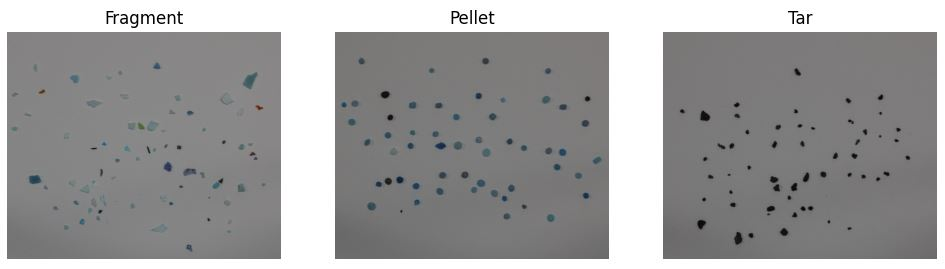
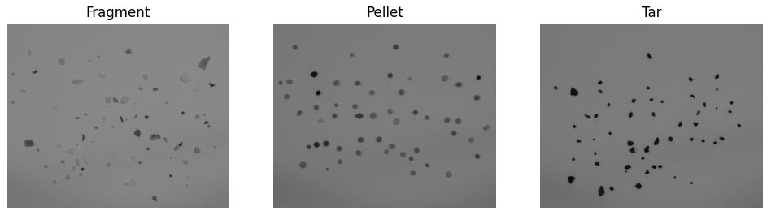
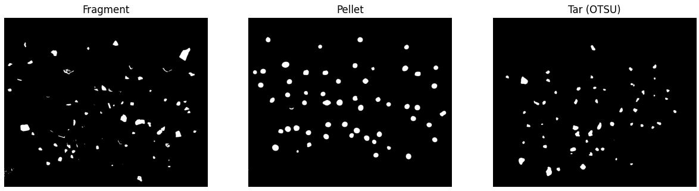

# Práctica 3 - Detección y reconocimiento de formas

  En esta práctica el objetivo es adquirir nociones para extraer información geométrica de objetos presentes en una imagen, con el fin de caracterizarlos y posteriormente ser capaz de identificarlos de forma automática en categorías.. Las áreas clave incluyen el análisis caractarístico de las formas que tienen los objetos como las monedas (Tarea 1) y los microplásticos (Tarea 2). El objetivo principal es darnos cuenta de que podemos utilizar relaciones geométricas, matemáticas o visuales para poder clasificarnos. En esta práctica también aprenderemos aspectos complicados en la detección de formas como lo son: el brillo, las sombras, el contraste e incluso en una tarea, el deterioro del objeto.
## Autores

## Tecnologías
  - Python

## Librerías 
  - OpenCV
  - Matplotlib
  - NumPy
  - Seaborn

## TAREA 1: Detección de Bordes con Canny
  **Objetivo:** Captura una o varias imágenes con monedas no solapadas. Tras visualizar la imagen, identifica de forma interactiva (por ejemplo haciendo clic en la imagen) una moneda de un valor determinado en la imagen (por ejemplo de 1€). Tras ello, la tarea se resuelve mostrando por pantalla el número de monedas y la cantidad de dinero presentes en la imagen. No hay restricciones sobre utilizar medidas geométricas o de color. ¿Qué problemas han observado?

  - Procedimiento seguido:

  1. Inicializamos las imágenes y las variables globales.

<!-- Filas de dos fotos cada una -->

    <!-- Fila 1 -->
    

        
    

&nbsp;

  2. Intentamos detectar el fondo de la imagen para posteriormente convertirlo a blanco y conseguir un mejor contraste entre el fondo y las monedas. Con esto se busca conseguir que la detección de las monedas sea más precisa.
  
  <!-- Filas de dos fotos cada una -->

    <!-- Fila 1 -->
    

        
    

&nbsp;

  3. A continuación comenzamos a detectar monedas. Para ello convertimos a una escala de griseses y y un filtro de desenfoque para reducir el ruido. Luego utilizamos la función cv2.HoughCircles() en la que configuramos los parámetros: resolución de acumulación (dp), la distancia mínima entre círculos (minDist) y el rango del radio. Si se detectan círculos los convierte a enteros y los guarda en una lista como tuplas (x, y, r), donde x y y son las coordenadas del centro y r es el radio del círculo.

  4. Una vez hemos detectado los círculos, procedemos a aplicarle dos filtros para buscar las monedas según su color. El primer filtro se encarga de encontrar las que son de color dorado (0.10€, 0.20€, 0.50€, 1€ y 2€). El otro filtro se encarga de buscar (0.01€, 0.02€ y 0.05€), es decir, las de color cobrizo. Se usa este enfoque para que los parámetros de color estén bien segmentados y evitar falsos positivos. Finalmente se unen ambas detecciones en una misma estructura de datos.

  5. Para que la visualización sea más adecuada las detecciones se superponen a la imagen original dando la sensación de que las detecciones han sido sobre la imagen original sin haber aplicado transformaciones a la imagen.

  6. Finalmente se muestran los resultados. En ellos se reflejan: el número de monedas detectadas, la suma total de las monedas detectadas y de cara a comprobar la fiabilidad del sistema el error producido entre la realidad de la suma del valor y el conteo de monedas real con respecto al obtenido.
  
  **Resultado:**
  Con esta tarea hemos comprobado que no es una tarea trivial el hecho de que el computador sea capaz de reconocer formas. En concreto se ve que en las dos imágenes de prueba, son factores determinantes: el estado de la moneda, el brillo que pueda tener la moneda por consecuencia de la luz, las sombras que se puedan generar también a causa de la luz, la presencia de una referencia para poder clasificar las monedas y la distancia a la que se encuentra la imagen. Estos son factores que pueden hacer que el reconocimiento de formas sea una tarea complicada. 
  
      

&nbsp;

<!-- Filas de dos fotos cada una -->

    <!-- Fila 1 -->
    

        
    

## TAREA 2: Detección y Segmentación de partículas entre Fragmentos, Pellets y Alquitrán.

  **Objetivo:** Aplicar umbralizado y preprocesamiento de imágenes para realizar un posterior conteo y una clasficicación de las partículas detectadas en las imágenes proporcionadas. 

1. **Procesamiento inicial de la Imagen**
  - Se recortan las imágenes para evitar posibles espacios en blanco o sombras que puedan causar falsos positivos.
  

      <!-- Fila 1 -->
      

          
      

  

  
  
&nbsp;

  
  - Se pasan las imágenes a escala de grises para separar mejor los contrastes de colores entre bordes y fondo.
    
  

      <!-- Fila 1 -->
      

          
      

  

  
&nbsp;

  - Se umbralizan las imágenes para identificar los contornos de los objetos presentes en ellas.

  

      <!-- Fila 1 -->
      

          
      

  

  
&nbsp;

2. **Detección y Análisis de Contornos**
  - Se identifican los contornos de los objetos mediante cv2.findContours().
  - Se calculan propiedades como el área, perímetro, compacidad, relación de aspecto y circularidad de los contornos para ayudar en la clasificación.
  - Se utiliza el ajuste de elipses (cv2.fitEllipse()) para analizar la forma de los objetos y su excentricidad.

3. **Clasificación de Objetos**
  - Fragmentos: Se identifican por su baja compacidad y su aspecto más irregular.
  - Pellets: Generalmente son redondos y se caracterizan por una alta circularidad y una relación de aspecto cercana a 1.
  - Alquitrán: Estas partículas suelen ser más oscuras, por lo que se clasifican principalmente basándose en su valor promedio de color.

4. **Visualización de Resultados**
  - Los resultados se visualizan mediante una matriz de confusión que compara los valores reales con los predichos.
  - Se genera un heatmap para mostrar de forma clara la distribución de los objetos clasificados.
  
  **Resultado:**

  

      <!-- Fila 1 -->
      

          
      

  

  
&nbsp;

  

  - Se identifican 71 Fragmentos en total, de los cuales 65 han sido clasificados de manera correcta.
  - Se identifican 51 Pellets en total, de los cuales 48 han sido clasificados de manera correcta.
  - Se identifican 57 Tar (Alquitrán) en total, de los cuales 43 han sido clasificados de manera correcta.

  

