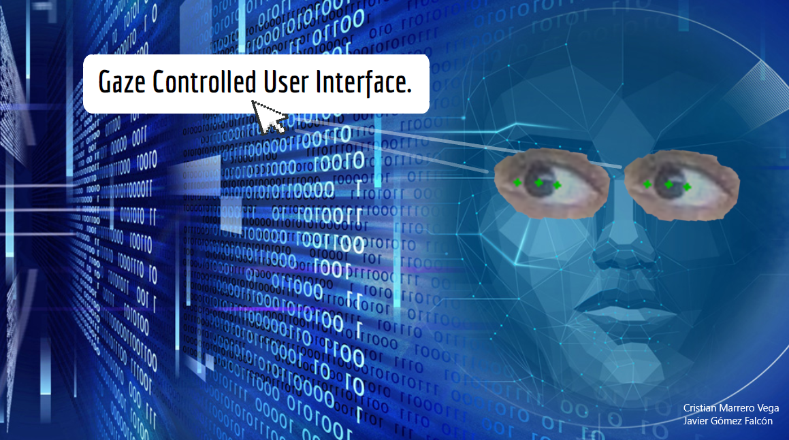

## Gaze Controlled User Interface
Este repositorio contiene código en Python para la creación de un sistema de gaze tracking funcional que permita controlar el cursor en una pantalla utilizando la mirada. Se busca lograr una interacción básica con el ordenador, como la lectura de artículos, navegación web y cierre de ventanas, utilizando la información visual obtenida de la webcam a través de un proceso básico de calibración y un modelo de regresión lineal para inferir la información.

## Autores

    <!-- Fila 1 -->
    

        
    

